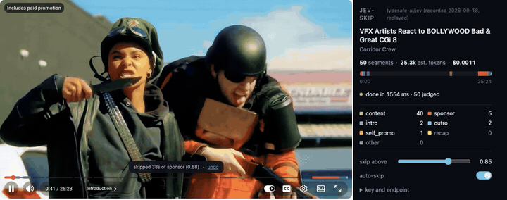

# jev-skip

Skips YouTube sponsors on videos nobody has labeled yet. Catches 77% of the sponsor seconds
SponsorBlock's crowd marked across 23 videos, at 34s of false skips per hour, for $0.0008 a
video, with the bar painted 0.9s after the request goes out.

    npm install && npm run build   # then load dist/chrome-mv3 unpacked, paste your key

Nine seconds, one take: the extension reads the captions, asks once, paints ten slices and
jumps 38 seconds of a Squarespace read it was never told about. The popup on the right is
the same run, live: 50 segments, 25.3k tokens, $0.0011, answered in 1546 ms. In the clip the
answers come from `fixtures/answers/`, recorded 2026-09-18 and replayed at their recorded
latency, because this machine has no key. Everything else in frame is happening.

Numbers from `npm run measure` over the fixtures in this repo, answered through a Vercel AI
Gateway shim rather than the direct API. Re-measure on `api.typesafe.ai` before pinning
anything to `jev-1.13.0`.

## Why

Every sponsor skipper on the market waits for a stranger to submit the timestamps.
SponsorBlock is excellent at that and it is always late: a video uploaded an hour ago has no
segments until someone watches it, notices the read, drags two handles and submits. For most
videos that never happens at all.

This one reads the caption track of the video you are already watching, sends the transcript
to Jev once, and gets back a probability per 30-second segment. The bar is painted before the
intro is over, on a video nobody has ever labeled. Slices are tinted by how sure the model is,
so a borderline sponsor is a ghost and a confident one is solid, and you can see the doubt
instead of guessing at it.

The honest limit lives here rather than only at the bottom: it reads text, not audio. No
captions, no opinion, and the extension does nothing at all.

Getting at those captions is the fragile part. The caption URL in YouTube's page data is
answered with 200 and an empty body unless it carries a proof-of-origin token, which the
player mints in the page world. So the extension watches for the URL the player signs for
itself and re-asks for the same one as json3. Measured, not assumed: see
`docs/browser-ground-truth.md`. It works today and it is exactly the kind of thing YouTube
changes.

## Install

    git clone https://github.com/valentynkit/jev-skip && cd jev-skip
    npm install && npm run build

Chrome: `chrome://extensions`, developer mode, load unpacked, pick `dist/chrome-mv3`.
Firefox: `npm run build:firefox`, then `about:debugging`, load `dist/firefox-mv2/manifest.json`.
Open the popup and paste your TypeSafe key.

| variable | required | purpose |
|---|---|---|
| key in the popup | yes | your TypeSafe key, stored in the extension, sent only to the endpoint below |
| endpoint in the popup | no | defaults to `https://api.typesafe.ai`, point it at a local shim if you use one |
| `TYPESAFE_API_KEY` | no | only for `npm run record`, which rebuilds the fixture corpus |

## Privacy and permissions

Hosts: `youtube.com` to read the page you are on, `api.typesafe.ai` to ask the question.
What leaves your browser: the title, channel and caption text of the video you are watching,
under your own key. Nothing else, to nobody else. There is no server of ours, no account, no
telemetry, and no shared database. The key lives in extension storage that only the
background worker touches. On Chrome the content script is refused access to it, which was
checked against the browser rather than the docs (`scripts/keycheck.mjs`). Firefox has no
equivalent control, so there a content script could read it.

One script runs in the page itself, to see the caption URL the player signs. It reads that
URL and the video's title; it never sees the key.

## How it works

1. A page-world script keeps the caption URL the player signs for itself, and the content
   script re-asks for it as json3. If the player has not asked for captions within a few
   seconds, the extension asks it to load a track and puts your previous choice back.
   Nothing to read means stop here.
2. Cues are deduped, then cut into 30-second windows snapped to sentence ends, capped at 45s.
3. A regex belt marks windows carrying a URL, a coupon-code shape or "use my link". Evidence
   code found, not a verdict.
4. The background worker sends the transcript once and one question per segment, then Jev
   answers all of them in a single request: `content, sponsor, intro, outro, self_promo,
   recap, other`.
5. Answers paint the seek bar as they arrive, one hue per category with colour strength
   from the probability, and arm one timer for the next segment over your threshold. Below
   it, on `other`, during an ad, or on any error, nothing is skipped.

## Development

    npm test          # offline, against scripts/fake-jev.ts, no key and no network
    npm run measure   # the headline number over fixtures/, offline
    npm run record -- --dry-run   # re-select the 30-video corpus from SponsorBlock, write nothing
    npm run record -- --corpus    # fetch captions and crowd labels for the selection
    npm run record                # judge the corpus once and cache the answers, needs a key

`measure` writes `measure.json` next to the four lines: per-video rows, the threshold sweep,
the reliability bins, the pessimistic intersection-over-union figure, and the non-English
videos it kept out of the headline. `thresholds.json` turns the recall floor and the
false-skip ceiling into exit codes.

## Known limits

- No captions, no opinion. It reads text, not audio.
- The caption read depends on the player signing a URL and on us seeing it. It sometimes
  does not paint on the first load; reloading the page fixes it. Roughly one attempt in
  three came up empty while filming the demo, which is a real reliability problem and not
  yet a measured number.
- If YouTube changes how the player requests captions, this breaks. That is one upstream
  decision away, and the repo has no fallback for it.
- Chrome is the only browser this has run in. Firefox MV2 builds and is untested. Arc
  silently drops the extension's storage writes, so the key cannot be saved there at all.
- Sponsor versus the creator's own plug is fuzzy, and the crowd disagrees with itself there.
- Unsure segments are painted faint and never skipped. It under-skips on purpose.
- Non-English captions are weaker and are reported separately, never in the headline.
- Every published number came through a gateway shim, not the direct API, on 23 videos. No
  live call has ever been made from the extension itself.

## License

MIT.
